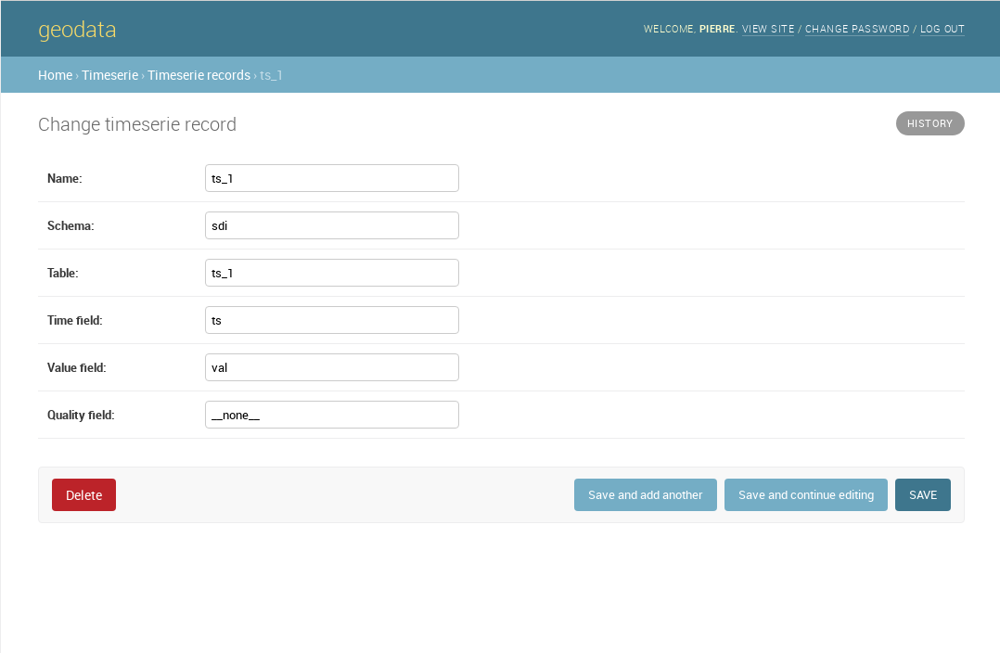
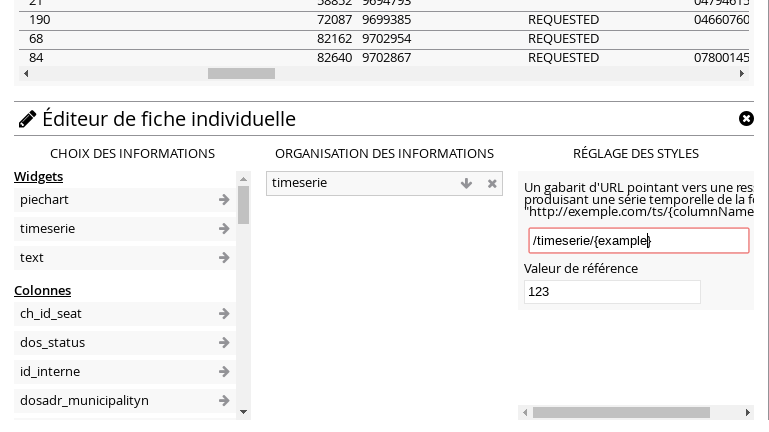

time series
===========

Time series are resources encoded in the geodata admin that can be referenced in maps.

## admin

New time series records can be created in the Geodata admin at the address BASE_URL/admin/timeserie/timeserierecord/



The form will ask for a ```Name``` that will identify the time serie, it should match a name in the layer that will reference this record. The other fields of the form will be used to identify a specific table (```Schema```, ```Table```) and which columns should be used, ```Time field``` for a timestamp column and ```Value field``` for the corresponding value's column name. The ```Quality field``` should keep the special value "\_\_none__" and is reserved for future use.


## map 

When configuring the feature view, time serie records are inserted through a template where the column name holding the reference to the time serie is inserted between curly brackets. The templated string pointing to the SDI timeserie endpoint as in:

```
/timeserie/{colum_name}
```



Another field in the time serie widget configuration alows one to insert a reference value that will appear on the graph as a red line.


## note

Because it can prove a tedious job to encode all these records by hand, it's possible to automate this work through a server side script. Here such a script that's been used to encode records for the piezo map.

The script assumes an environment that is already setup, in the case of our deployment, you've got to go through the following steps

```bash
source /opt/venvs/sdi/bin/activate
export PYTHONPATH=/etc/sdi:/opt/venvs/sdi/lib/python3.5/site-packages/sdi
export DJANGO_SETTINGS_MODULE=config.main
```


```python
#!/usr/bin/env python
import django
django.setup()


from timeserie.models import TimeserieRecord

# station identifiers
piezo_stations =[  '526', '368', '322', '367', '301', '302', '305', '312', '315', '317', '324', '366', '369', '371', '374', '384', '387', '388', '391', '392', '393', '394', '396', '544', '397', '398', '399', '501', '502', '505', '506', '507', '516', '522', '525', '529', '524', '381', '503', '504', '509', '510', '511', '512', '513', '514', '515', '517', '518', '519', '520', '521', '523', '527', '528', '530', '531', '532', '389', '303', '540', '541', '542', '543', '533', '534', '535', '536', '537', '538', '539', '306', '304', ]


# template strings where brackets will be replaced by station identifiers
table_tpl = 'pz_data_{}'
time_field_tpl = 'data_{}_time'
value_field_tpl = 'data_{}_hp'

# we loop through all IDs to build a record if none exists
for s in piezo_stations:
    name = 'piezo_hp_{}'.format(s)
    try:
        TimeserieRecord.objects.get(name=name)
    except TimeserieRecord.DoesNotExist:
        TimeserieRecord.objects.create(
            name=name, 
            schema='groundwater', 
            table=table_tpl.format(s), 
            time_field=time_field_tpl.format(s), 
            value_field=value_field_tpl.format(s)
            )

```
